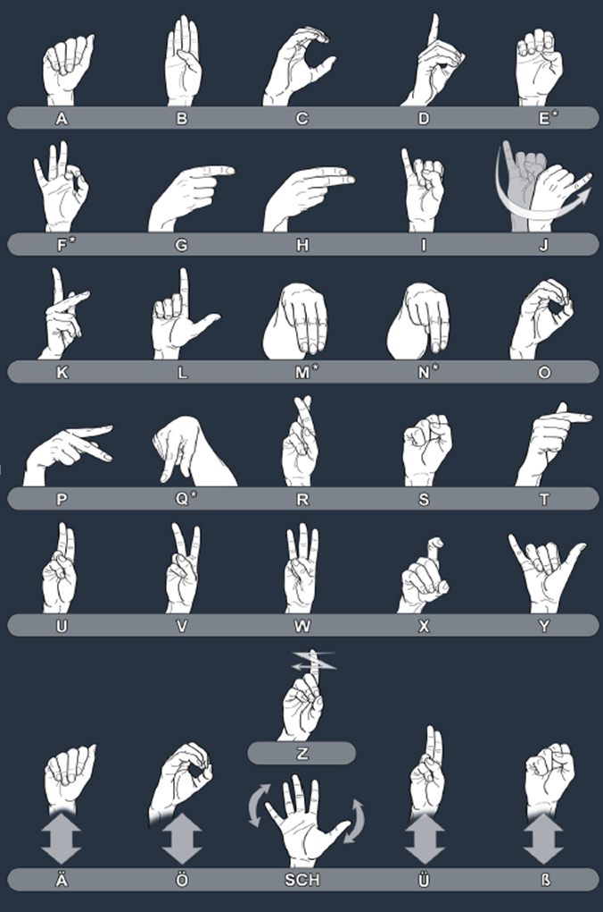
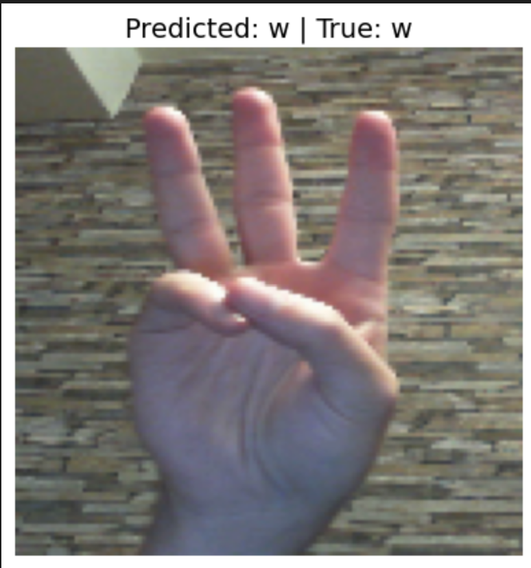

# Hand Gesture Recognition Using CNN and MediaPipe
## Overview
This project uses a Convolutional Neural Network (CNN) to recognize hand gestures in real-time via a webcam. It leverages TensorFlow for model training, MediaPipe for hand detection, and OpenCV for capturing the camera feed. The model classifies hand gestures into 24 categories, corresponding to the letters a through y.

## **Requirements**

- Python 3.x
- TensorFlow
- OpenCV
- MediaPipe
- Numpy
- Scikit-learn
- Matplotlib
- Pillow

Install dependencies with:
pip install tensorflow opencv-python mediapipe numpy scikit-learn matplotlib pillow

# Dataset
The dataset consists of 100 images for each hand gestures representing letters a to y. The images are processed using MediaPipe to crop the hand region, resized to 128x128 pixels, and normalized.

# Model
The CNN model consists of convolutional layers followed by dense layers. It is trained to classify hand gestures into 24 categories.

# Training and Test
Data Preprocessing: Images are cropped, resized, and normalized.
Model Training: The model is trained for 100 epochs using a batch size of 32 with early stopping to prevent overfitting.
Some of the test images, along with their predicted labels and true labels, can be seen below. These images provide insights into how well the model is performing in real-time gesture recognition.

# Real-time Inference
You can use the trained model to make real-time predictions from a camera feed. The system processes each frame from the webcam, detects the hand gesture using MediaPipe, and classifies it using the CNN model.

